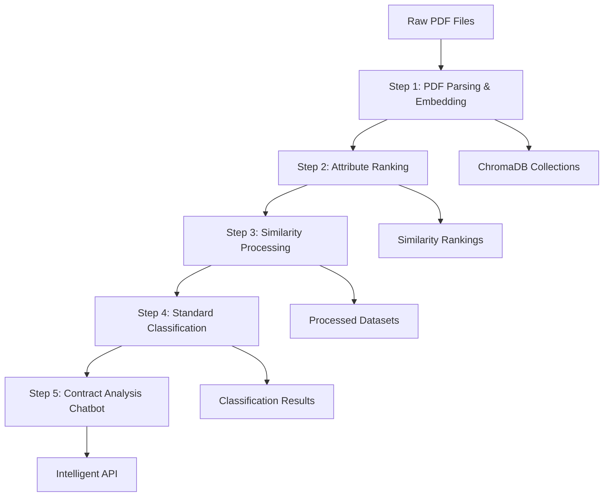

# HiLABS Complete Contract Analysis Pipeline

A comprehensive end-to-end pipeline for intelligent contract analysis, from raw PDF processing to AI-powered chatbot interactions. This system combines advanced NLP, machine learning, and vector databases to provide deep insights into legal contracts.
### Dashboard VideoLink - https://drive.google.com/file/d/1WBuW1pyRfArpyJWL1Lwd-r3okGZK82T5/view?usp=drive_link
### Solution Report Link- https://drive.google.com/file/d/1pST0L2U305IMgpyUXHJbv0wQNm0GuzYL/view?usp=drive_link
## 🎯 Overview

HiLABS transforms raw contract PDFs into an intelligent analysis system through a sophisticated 5-step pipeline:



## 🏗️ Architecture

### Microservices Architecture
```
┌─────────────────┐    ┌─────────────────┐    ┌─────────────────┐
│   Backend API   │    │ Embeddings API  │    │    ChromaDB     │
│   (Port 8000)   │◄──►│   (Port 8002)   │    │   (Port 8001)   │
└─────────────────┘    └─────────────────┘    └─────────────────┘
         │                        │                        ▲
         │                        │                        │
         ▼                        ▼                        │
┌─────────────────┐    ┌─────────────────┐                │
│     Ollama      │    │  PDF Processing │                │
│  (Port 11434)   │    │    Pipeline     │────────────────┘
└─────────────────┘    └─────────────────┘
```

### Pipeline Flow

```mermaid
flowchart LR
    subgraph "Step 1: PDF Processing"
        A1[PDF Upload] --> A2[OCR & Text Extraction]
        A2 --> A3[Markdown Conversion]
        A3 --> A4[Chunking]
        A4 --> A5[Initial Embeddings]
    end
    
    subgraph "Step 2: Attribute Ranking"
        B1[RRF Matching] --> B2[Dense Similarity]
        B2 --> B3[BM25 Sparse Retrieval]
        B3 --> B4[Rank Fusion]
    end
    
    subgraph "Step 3: Similarity Processing"
        C1[Text Preprocessing] --> C2[Qwen Embeddings]
        C2 --> C3[Paraphrase Embeddings]
        C3 --> C4[ChromaDB Storage]
    end
    
    subgraph "Step 4: Classification"
        D1[Exact Match] --> D2[Semantic Similarity]
        D2 --> D3[NLI Analysis]
        D3 --> D4[Rule Flags]
        D4 --> D5[Final Classification]
    end
    
    subgraph "Step 5: Chatbot"
        E1[FastAPI Server] --> E2[Query Processing]
        E2 --> E3[Context Retrieval]
        E3 --> E4[LLM Response]
    end
    
    A5 --> B1
    B4 --> C1
    C4 --> D1
    D5 --> E1
```


## 🚀 Quick Start

### Docker Deployment (Recommended)
```bash
# Clone repository
git clone <repository-url>
cd preprocess

# Place your PDF files in data/Contracts_data/WA/
mkdir -p data/Contracts_data/WA/
# Copy WA_5_Redacted.pdf to data/Contracts_data/WA/

# Start all services
docker-compose up -d

# Check service status
docker-compose ps

# Access the chatbot
curl -X POST http://localhost:8000/chatbot/chat \
  -H "Content-Type: application/json" \
  -d '{"message": "How many non-standard clauses are there?", "session_id": "test"}'
```

### Manual Setup
```bash
# Install system dependencies
sudo apt-get install tesseract-ocr poppler-utils
curl -fsSL https://ollama.ai/install.sh | sh

# Install Python dependencies
pip install -r requirements.txt
python -m spacy download en_core_web_sm

# Pull Ollama models
ollama pull qwen3-embedding:0.6b
ollama pull phi3:mini

# Run complete pipeline
python main.py
```

## 📋 Detailed Pipeline Steps

### Step 1: PDF Parsing & Embedding (15-30 minutes)
**Purpose**: Transform raw PDFs into structured, searchable content

**What it does**:
- **OCR Processing**: Uses Tesseract for image-based text extraction
- **Memory Optimization**: Processes large PDFs (99MB+) in batches
- **Structure Detection**: Identifies sections, clauses, and page boundaries
- **Markdown Conversion**: Creates structured markdown with proper formatting
- **Initial Embeddings**: Generates vector embeddings for semantic search

**Input**: Raw PDF files (e.g., `WA_5_Redacted.pdf`)
**Output**: 
- Parsed markdown files
- ChromaDB collection `WAredacted` with ~500-1000 chunks
- Structured metadata with page numbers and sections

**Script**: `ParsingAndEmbedding/PDFParsingAndEmbedding/process_wa5_pipeline.py`

### Step 2: Attribute Ranking (10-20 minutes)
**Purpose**: Find the most similar contract clauses for each attribute using advanced ranking

**What it does**:
- **RRF (Reciprocal Rank Fusion)**: Combines multiple ranking methods
- **Dense Similarity**: Cosine similarity with embeddings
- **BM25 Sparse Retrieval**: Keyword-based matching
- **Multi-Collection Search**: Searches across TNstandard, WAstandard, TNredacted, WAredacted
- **Top-K Selection**: Finds top 10-20 matches per attribute per collection

**Input**: ChromaDB collections from Step 1
**Output**: 4 similarity JSON files with ranked matches
- `TNredacted_precise_attribute_similarities.json`
- `WAredacted_precise_attribute_similarities.json`
- `TNstandard_precise_attribute_similarities.json`
- `WAstandard_precise_attribute_similarities.json`

**Script**: `Ranker/attribute_precise_similarity_pipeline.py`

### Step 3: Similarity Preprocessing & Embedding (5-15 minutes)
**Purpose**: Process similarity results and generate dual embeddings for classification

**What it does**:
- **Text Preprocessing**: Unicode normalization, stopword removal, tokenization
- **Dual Embeddings**: Generates both Qwen and Paraphrase embeddings
- **Dataset Creation**: Creates ~12 processed datasets (per source file)
- **Metadata Enrichment**: Adds preprocessing metadata, token counts, SHA256 hashes
- **ChromaDB Storage**: Stores in separate collections by embedding type

**Input**: Similarity JSON files from Step 2
**Output**: 
- `outputs/precise_similarity/processed_datasets/` with ~12 JSON files
- ChromaDB collections: `similarityTemplate_qwen`, `similarityTemplate_para`, `SimilarityRedacted_qwen`, `SimilarityRedacted_para`

**Script**: `PreprocessingSimilarity/similarity_pipeline.py`

### Step 4: Standard Classification (20-40 minutes)
**Purpose**: Classify clauses as standard vs non-standard using multi-step ML approach

**What it does**:
- **Step 1 - Exact Match**: Structural similarity matching
- **Step 2 - Semantic Similarity**: Qwen embeddings with τ=0.80 threshold
- **Step 3 - Paraphrase Similarity**: Paraphrase embeddings with τ=0.75 threshold
- **Step 4 - NLI Analysis**: Natural Language Inference using DeBERTa-large-MNLI
- **Step 5 - Negation Analysis**: spaCy-based negation scope analysis
- **Step 6 - Rule Flags**: Pattern matching for forbidden modifications
- **Final Decision**: Combines all steps for final `isStandard` classification

**Input**: Processed datasets from Step 3
**Output**: 
- Updated datasets with `isStandard` field (0 or 1)
- `StandardClassification/classification_summary.json`
- `StandardClassification/classification_report.txt`
- Standard-only datasets in `StandardClassification/standard_final/`

**Scripts**: 
- `StandardClassification/pipeline.py` (orchestrator)
- `StandardClassification/exact_structure_classifier.py`
- `StandardClassification/multi_step_classifier.py`
- `StandardClassification/analysis_summary.py`

### Step 5: Contract Analysis Chatbot (Continuous)
**Purpose**: Provide intelligent contract analysis through conversational AI

**What it does**:
- **FastAPI Server**: RESTful API with comprehensive endpoints
- **LLM Integration**: Uses Ollama with phi3:mini for intelligent responses
- **Context Retrieval**: Searches classified datasets for relevant information
- **Session Management**: Maintains conversation history
- **Statistical Analysis**: Provides contract summaries and metrics
- **Natural Language Queries**: Supports complex questions about contracts

**Input**: Classified datasets from Step 4
**Output**: Running FastAPI server with endpoints:
- `POST /chatbot/chat` - Main chat interface
- `GET /chatbot/health` - Health check
- `GET /chatbot/contracts/summary` - Contract statistics
- `GET /chatbot/sessions/{id}/history` - Chat history

**Script**: `backend/main.py`

## 📁 Project Structure

```
preprocess/
├── 🎯 ORCHESTRATION
│   ├── main.py                           # Main pipeline orchestrator
│   ├── docker-compose.yml                # Docker services configuration
│   ├── Dockerfile                        # Container build instructions
│   ├── requirements.txt                  # Unified Python dependencies
│   └── pipeline.log                      # Execution logs
│
├── 📄 DATA & OUTPUTS
│   ├── data/                            # Raw input data
│   │   └── Contracts_data/WA/WA_5_Redacted.pdf
│   └── outputs/                         # Generated outputs
│       ├── pdf_parsed/WA/WA_5_Redacted.md
│       ├── precise_similarity/          # Similarity rankings
│       │   ├── TNredacted_precise_attribute_similarities.json
│       │   ├── WAredacted_precise_attribute_similarities.json
│       │   ├── TNstandard_precise_attribute_similarities.json
│       │   ├── WAstandard_precise_attribute_similarities.json
│       │   └── processed_datasets/      # ~12 processed JSON files
│       └── chroma_db_qwen/              # ChromaDB vector database
│
├── 🔧 STEP 1: PDF PROCESSING
│   └── ParsingAndEmbedding/
│       └── PDFParsingAndEmbedding/
│           ├── process_wa5_pipeline.py   # WA5 PDF processing pipeline
│           └── requirements_wa5.txt     # PDF processing dependencies
│
├── 📊 STEP 2: ATTRIBUTE RANKING
│   └── Ranker/
│       ├── attribute_precise_similarity_pipeline.py  # RRF-based ranking
│       ├── rrf_attribute_matcher.py     # Core RRF matching logic
│       └── requirements.txt             # Ranking dependencies
│
├── 🔄 STEP 3: SIMILARITY PROCESSING
│   └── PreprocessingSimilarity/
│       ├── similarity_pipeline.py       # Combined preprocessing & embedding
│       ├── preprocess_precise_full_content.py  # Legacy preprocessing
│       ├── paraphrase_ollama_embedding.py      # Legacy embedding
│       ├── requirements.txt             # Similarity processing dependencies
│       └── README.md                    # Detailed similarity documentation
│
├── 🎯 STEP 4: CLASSIFICATION
│   └── StandardClassification/
│       ├── pipeline.py                  # Classification orchestrator
│       ├── exact_structure_classifier.py        # Step 1: Exact matching
│       ├── multi_step_classifier.py     # Steps 2-6: ML classification
│       ├── analysis_summary.py          # Results analysis
│       ├── requirements.txt             # Classification dependencies
│       ├── standard/                    # Exact match results
│       └── standard_final/              # Final classification results
│
├── 🤖 STEP 5: CHATBOT API
│   └── backend/
│       ├── main.py                      # FastAPI application
│       ├── routes/
│       │   └── chatbot_routes.py        # Chat endpoints
│       ├── requirements.txt             # Backend dependencies
│       ├── chatbot_frontend_example.html # Demo frontend
│       └── README_CHATBOT.md            # Chatbot documentation
│
└── 📚 DOCUMENTATION & CONFIG
    ├── SETUP.md                         # Comprehensive setup guide
    ├── .env.example                     # Environment variables template
    ├── docker-compose.prod.yml          # Production Docker configuration
    ├── nginx.conf                       # Production reverse proxy
    └── .dockerignore                    # Docker build optimization
```

## 🎯 Usage Examples

### Complete Pipeline Execution
```bash
# Run all 5 steps sequentially (50-120 minutes total)
python main.py

# Expected flow:
# 1. PDF Parsing (15-30 min) → Markdown + Initial embeddings
# 2. Attribute Ranking (10-20 min) → Similarity rankings
# 3. Similarity Processing (5-15 min) → Processed datasets + Dual embeddings
# 4. Standard Classification (20-40 min) → isStandard classifications
# 5. Chatbot Server (Continuous) → API server startup
```

### Selective Step Execution
```bash
# Run only classification (assumes previous steps completed)
python main.py --step 4

# Run similarity processing and classification
python main.py --skip-steps 1,2

# Skip PDF processing (use existing parsed data)
python main.py --skip-steps 1

# Check current pipeline status
python main.py --status
```

### Docker Deployment
```bash
# Development environment
docker-compose up -d

# Production environment with resource limits
docker-compose -f docker-compose.yml -f docker-compose.prod.yml up -d

# Scale services for higher throughput
docker-compose up -d --scale hilabs-pipeline=2

# Monitor services
docker-compose ps
docker-compose logs -f hilabs-pipeline
```

### API Interactions
```bash
# Health check
curl http://localhost:8000/health

# Contract summary statistics
curl http://localhost:8000/chatbot/contracts/summary

# Chat with the AI about contracts
curl -X POST http://localhost:8000/chatbot/chat \
  -H "Content-Type: application/json" \
  -d '{
    "message": "How many non-standard clauses are in TN Contract 1?",
    "session_id": "analysis-session-1"
  }'

# Complex analytical query
curl -X POST http://localhost:8000/chatbot/chat \
  -H "Content-Type: application/json" \
  -d '{
    "message": "Find all clauses related to Medicaid with page numbers",
    "session_id": "research-session"
  }'
```

## 📊 Expected Outputs & Results

### After Step 1: PDF Parsing
- **Parsed Content**: `outputs/pdf_parsed/WA/WA_5_Redacted.md` (structured markdown)
- **Vector Database**: ChromaDB collection `WAredacted` with 500-1000 semantic chunks
- **Metadata**: Page numbers, sections, chunk boundaries preserved

### After Step 2: Attribute Ranking
- **Similarity Files**: 4 comprehensive JSON files (20-40MB total)
  - TNredacted: ~8-15MB with top 20 matches per attribute
  - WAredacted: ~8-15MB with top 20 matches per attribute
  - TNstandard: ~2-5MB with top 10 matches per attribute
  - WAstandard: ~2-5MB with top 10 matches per attribute
- **Quality Metrics**: RRF scores, dense similarity, BM25 scores for each match

### After Step 3: Similarity Processing
- **Processed Datasets**: ~12 JSON files in `processed_datasets/`
  - Per-source datasets for redacted contracts
  - Global datasets for standard templates
- **Dual Embeddings**: 4 ChromaDB collections
  - `similarityTemplate_qwen` & `similarityTemplate_para` (standard templates)
  - `SimilarityRedacted_qwen` & `SimilarityRedacted_para` (redacted contracts)
- **Enhanced Metadata**: Token counts, SHA256 hashes, preprocessing versions

### After Step 4: Standard Classification
- **Classification Results**: All datasets updated with `isStandard` field (0 or 1)
- **Summary Reports**: 
  - `classification_summary.json`: Statistical breakdown
  - `classification_report.txt`: Human-readable analysis
- **Filtered Datasets**: Standard-only clauses in `standard_final/` directory
- **Classification Metadata**: Step-by-step reasoning, similarity scores, rule flags

### After Step 5: Chatbot Deployment
- **API Server**: FastAPI server running on port 8000
- **Interactive Capabilities**:
  - Natural language contract queries
  - Statistical analysis and summaries
  - Clause-specific searches with context
  - Session-based conversation history
- **Response Quality**: <2 seconds for most queries, contextually accurate answers

## 🔧 Technical Specifications

### System Requirements
- **CPU**: 8+ cores recommended (4 minimum)
- **RAM**: 16GB recommended (8GB minimum)
- **Storage**: 50GB+ SSD for optimal performance
- **GPU**: Optional (accelerates transformer models)

### Model Dependencies
- **Ollama Models**:
  - `qwen3-embedding:0.6b` (1024-dimensional embeddings)
  - `phi3:mini` (2B parameter chat model)
- **Transformer Models**:
  - `microsoft/deberta-large-mnli` (NLI analysis)
  - `paraphrase-MiniLM-L6-v2` (384-dimensional embeddings)
- **spaCy Model**: `en_core_web_sm` (English language processing)

### Performance Metrics
- **Total Pipeline Time**: 50-120 minutes (hardware dependent)
- **Peak Memory Usage**: 4-8GB (with optimization)
- **Storage Requirements**: 5-10GB for complete outputs
- **API Response Time**: <2 seconds for most queries
- **Throughput**: ~100 chunks/minute for embedding generation

## 🔍 Advanced Features

### Multi-Step Classification Algorithm
The classification system uses a sophisticated 6-step approach:

1. **Exact Structural Match**: Fast exact matching for known patterns
2. **Semantic Similarity**: Qwen embeddings with 0.80 threshold
3. **Paraphrase Similarity**: Sentence-BERT embeddings with 0.75 threshold
4. **Natural Language Inference**: Two-way entailment checking
5. **Negation Scope Analysis**: spaCy-based negation pattern detection
6. **Rule-Based Flags**: Pattern matching for forbidden modifications

### RRF (Reciprocal Rank Fusion) Ranking
Combines multiple ranking methods for optimal results:
- **Dense Retrieval**: Semantic similarity using embeddings
- **Sparse Retrieval**: BM25 keyword matching
- **Fusion Formula**: `RRF(d) = Σ(1/(k + rank_i(d)))` where k=60

### Memory Optimization Techniques
- **Batch Processing**: OCR and embeddings processed in configurable batches
- **Lazy Loading**: Models loaded only when needed
- **Garbage Collection**: Explicit memory cleanup between processing steps
- **Streaming**: Large files processed in chunks to prevent OOM errors

## 🚨 Troubleshooting

### Common Issues & Solutions

#### Ollama Not Running
```bash
# Check Ollama status
curl http://localhost:11434/api/tags

# Start Ollama service
ollama serve &

# Pull missing models
ollama pull qwen3-embedding:0.6b
ollama pull phi3:mini

# Verify models are available
ollama list
```

#### Memory Issues During Processing
```bash
# Monitor memory usage
python main.py --status

# Run steps individually if needed
python main.py --step 1  # PDF processing
python main.py --step 2  # Ranking
# ... continue step by step

# Check system resources
htop
free -h
```

#### ChromaDB Collection Conflicts
```bash
# Check existing collections
python -c "
import chromadb
client = chromadb.PersistentClient(path='chroma_db_qwen')
print([c.name for c in client.list_collections()])
"

# Reset ChromaDB if corrupted
rm -rf chroma_db_qwen/
python main.py --step 1  # Rebuild from scratch
```

#### Classification Performance Issues
```bash
# Monitor classification progress
tail -f pipeline.log

# Check GPU availability for transformers
python -c "import torch; print(f'CUDA available: {torch.cuda.is_available()}')"

# Use CPU-only mode if GPU issues
export CUDA_VISIBLE_DEVICES=""
```

### Docker Troubleshooting
```bash
# Check service health
docker-compose ps

# View service logs
docker-compose logs -f ollama
docker-compose logs -f chromadb
docker-compose logs -f hilabs-pipeline

# Restart specific service
docker-compose restart ollama

# Rebuild containers
docker-compose build --no-cache
docker-compose up -d
```

## 🚀 Production Deployment

### Docker Production Setup
```bash
# Production deployment with resource limits
docker-compose -f docker-compose.yml -f docker-compose.prod.yml up -d

# Monitor resource usage
docker stats

# Scale services for high availability
docker-compose up -d --scale hilabs-pipeline=2
```

### Environment Configuration
```bash
# Copy environment template
cp .env.example .env

# Edit configuration
nano .env

# Key variables:
# OLLAMA_URL=http://ollama:11434
# CHROMADB_URL=http://chromadb:8000
# LOG_LEVEL=INFO
# BATCH_SIZE=64
```

### Reverse Proxy Setup (Nginx)
```nginx
server {
    listen 80;
    server_name your-domain.com;
    
    location / {
        proxy_pass http://localhost:8000;
        proxy_set_header Host $host;
        proxy_set_header X-Real-IP $remote_addr;
        proxy_set_header X-Forwarded-For $proxy_add_x_forwarded_for;
    }
}
```

## 📈 Performance Optimization

### Hardware Optimization
- **SSD Storage**: Significantly improves I/O performance
- **GPU Acceleration**: Use CUDA for transformer models
- **Memory**: 32GB+ recommended for large document processing
- **CPU**: Multi-core processors benefit parallel processing steps

### Software Optimization
```bash
# Use GPU for transformers (if available)
pip install torch torchvision torchaudio --index-url https://download.pytorch.org/whl/cu118

# Optimize batch sizes
export BATCH_SIZE=128  # Increase for more RAM/GPU memory

# Enable parallel processing
export MAX_WORKERS=8   # Match CPU core count
```

### Monitoring & Metrics
```bash
# System monitoring
htop
nvidia-smi  # If using GPU
iotop       # I/O monitoring

# Application monitoring
curl http://localhost:8000/health
docker-compose logs --tail=100 -f

# Performance profiling
python -m cProfile main.py --step 4
```

## 🔐 Security Considerations

### API Security
- **Authentication**: Implement API keys for production use
- **Rate Limiting**: Prevent abuse with request throttling
- **Input Validation**: Sanitize all user inputs
- **CORS Configuration**: Restrict cross-origin requests

### Data Security
```bash
# Secure data directories
chmod 700 data/
chmod 600 data/Contracts_data/WA/*.pdf

# Use environment variables for sensitive config
export OLLAMA_API_KEY="your-secure-key"
export DATABASE_URL="secure-connection-string"
```

### Container Security
```yaml
# docker-compose.yml security settings
security_opt:
  - no-new-privileges:true
read_only: true
tmpfs:
  - /tmp
user: "1000:1000"
```

## 🤝 Contributing

### Development Setup
```bash
# Clone repository
git clone <repository-url>
cd preprocess

# Create development environment
python -m venv dev-env
source dev-env/bin/activate

# Install development dependencies
pip install -r requirements.txt
pip install black isort flake8 pytest

# Install pre-commit hooks
pre-commit install
```

### Code Quality
```bash
# Format code
black .
isort .

# Lint code
flake8 .

# Run tests
pytest tests/

# Type checking
mypy main.py
```

### Adding New Features
1. **Follow existing patterns**: Each pipeline step is modular
2. **Add comprehensive logging**: Use the established logging format
3. **Include error handling**: Graceful failure and recovery
4. **Update documentation**: Keep README and docstrings current
5. **Add tests**: Unit tests for new functionality
6. **Update orchestrator**: Modify `main.py` if adding new steps

## 📄 License

This project is licensed under the MIT License. See LICENSE file for details.

## 📞 Support

### Getting Help
1. **Check logs**: `tail -f pipeline.log`
2. **Verify status**: `python main.py --status`
3. **Test components**: Run individual steps for debugging
4. **Docker logs**: `docker-compose logs -f`

### Common Commands Reference
```bash
# Pipeline Management
python main.py                    # Complete pipeline
python main.py --step 4           # Specific step
python main.py --skip-steps 1,2   # Skip steps
python main.py --status           # Check status

# Docker Management
docker-compose up -d              # Start services
docker-compose down               # Stop services
docker-compose logs -f            # View logs
docker-compose exec hilabs-pipeline bash  # Shell access

# Service Health Checks
curl http://localhost:8000/health          # API health
curl http://localhost:11434/api/tags       # Ollama models
curl http://localhost:8001/api/v1/heartbeat # ChromaDB
```

---

**HiLABS** - Transforming contract analysis through intelligent automation and AI-powered insights.
